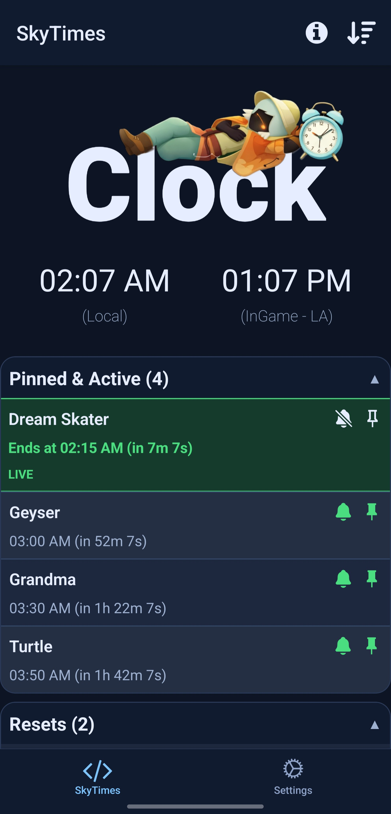
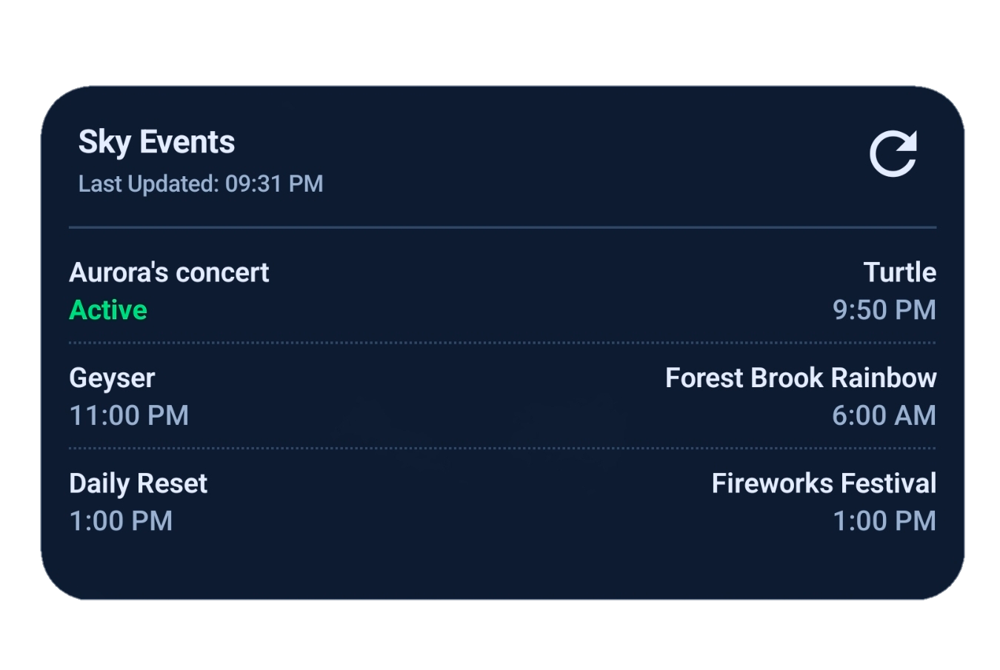

# SkyHelper App

A simple Expo app for browsing Sky: CoTL in-game events (grandma, turtle, geyser, etc...), pinning what you care about, and getting reminder notifications.

> [!IMPORTANT]  
> Only android is supported because I don't have macbook to build and test how the app accurately for iOS devices. For that reason, I have mostly opted to use jetpack-compose ui of expo which is only available for android.

## What it does

- Shows current and upcoming events.
- Keeps active and pinned events at the top.
- Lets you enable reminders per event with a custom offset.
- Home app widget (android) that shows upto 6 event times (You can also configure which 6 event shows up by long pressing the widget and clicking the settings icon)
- Supports light and dark themes.


<table>
  <tr>
    <td align="center">
      <br/><br />
      <sub>App Preview</sub>
    </td>
    <td align="center">
      <br/>
<br />
      <sub>App Widget Preview</sub>
    </td>
  </tr>
</table>


## Tech stack

- Expo + React Native
- Expo Router
- TypeScript
- `expo-notifications`
- AsyncStorage

## Getting started

### 1) Install dependencies

```bash
pnpm install
```

Then run on your target platform:

- Android: `pnpm android`
- iOS: `pnpm ios`
- Web: `pnpm web`

## Available scripts

- `pnpm start` - start Expo dev server
- `pnpm android` - run on Android
- `pnpm ios` - run on iOS
- `pnpm web` - run web build locally

## Notes

- Notification scheduling works on iOS/Android. Web does not support the same local notification flow.
- Notification settings, pinned events, reorder settings, and reminder offsets are saved locally on device storage.

